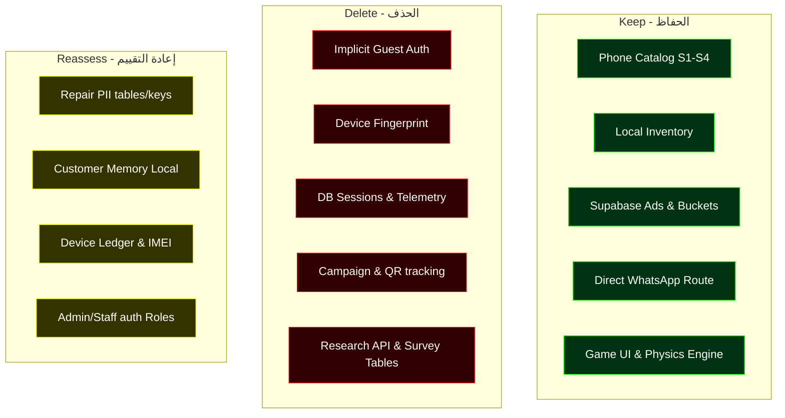

# PRIVACY DECOMMISSION — CURRENT STATE RECOVERY REPORT

**التاريخ:** 2026-08-08  
**الفرع:** `main`  
**HEAD الحالي:** `6ecbf3700afb0ec2d468ba295ff0081bea31cab2`  
**الحالة:** استرداد الحالة والتحقق - جاهز للمرحلة القادمة  

---

## 1. Git State (حالة المستودع)

نتيجة تشغيل `git status -sb`:
```bash
## main...origin/main
?? .opencode-summary/reports/scan-count-removal-100pct.md
```
تظهر شجرة العمل نظيفة تماماً من أي تعديلات على الملفات المتتبعة (Tracked Files). يوجد ملف واحد غير متتبع (Untracked) سنتعامل معه كأصل وثائقي تاريخي.

---

## 2. Current HEAD (مؤشر HEAD الحالي)

مؤشر `HEAD` المحلي يقف عند التزام (Commit):
`6ecbf3700afb0ec2d468ba295ff0081bea31cab2`
* **الرسالة:** `feat(privacy): P3 Stop-Write — no boot-time writes (no auto-guest, no telemetry sender, no QR/campaign attribution)`
* **التاريخ:** Sat Aug 8 00:47:32 2026 +0200
* **الكاتب:** `yahya2208 <y220890@gmail.com>`

---

## 3. Remote Synchronization (التزامن مع السيرفر)

* **السيرفر البعيد (Remote origin):** `https://github.com/yahya2208/focus22.git`
* **حالة التزامن:** الفرع المحلي `main` متزامن بالكامل مع الفرع البعيد `origin/main` عند الالتزام `6ecbf37` (`local main = origin/main = 6ecbf37`).
* لا توجد أي التزامات محلية غير مدفوعة (No unpushed commits) ولا تغييرات بعيدة مفقودة.

---

## 4. Working Tree (حالة الملفات المحلية)

* شجرة العمل نظيفة (Clean Working Tree) باستثناء الملف التالي غير المتتبع:
  `?? .opencode-summary/reports/scan-count-removal-100pct.md`
* لم يتم إجراء أي عمليات `reset` أو `rebase` أو تغيير للفروع.

---

## 5. Documents Reviewed (الوثائق التي تمت مراجعتها)

تمت قراءة ومراجعة الوثائق المرجعية بالكامل لفهم السياق التاريخي والقرارات الفنية:
1. [Discovery Report](file:///e:/dll/focus/focus22/docs/audits/privacy-data-minimization-discovery.md)
2. [Decommission Architecture Plan](file:///e:/dll/focus/focus22/docs/audits/privacy-data-minimization-decommission-plan.md)
3. [Privacy Execution Gate](file:///e:/dll/focus/focus22/docs/audits/privacy-execution-gate.md)
4. [P2/S4 Acceptance Report (AT-24)](file:///e:/dll/focus/focus22/docs/audits/p2-s4-acceptance-report.md)
5. [P3 Stop-Write Acceptance Test Suite](file:///e:/dll/focus/focus22/src/__tests__/privacy/p3-stop-write-gate.test.ts)
6. [Scan Count Removal Report (100% QR)](file:///e:/dll/focus/focus22/.opencode-summary/reports/scan-count-removal-100pct.md)

---

## 6. What P0/P1/P2/P3 Actually Completed (ما تم إنجازه فعلياً)

* **P0 (Freeze & Snapshot):** تجميد الكود والتقاط نسخة احتياطية من قاعدة البيانات وشجرة العمل.
* **P1 (Documentation Update):** تحديث وثائق التخطيط الفني والحد الأدنى للبيانات لتشمل القرارات الإدارية القاطعة (E-1 إلى E-13).
* **P2 (S4 Catalog - AT-24):** إنجاز محول الكتالوج (Catalog Adapter) لتصفح الأجهزة باستخدام الـ canonical loader مباشرة ودون الرجوع لبيانات `catalog_*_v1` مع الحفاظ على عزل الماركات وتجاوز البوابات خضراء.
* **P3 (Stop-Write Gate):** إيقاف جميع الكتابات عند إقلاع التطبيق (لا Auth ضيف تلقائي، لا telemetry sender يرسل لـ `analytics_events` عند Mount، ولا فك أو تتبع روابط QR/الحملات). تجاوزت بوابات P3 الـ 19 خضراء بالكامل.

---

## 7. What Remains (المراحل المتبقية للتنفيذ)

* **P4:** تقليل بيانات اللعبة الشخصية (إزالة بصمات الأجهزة وكتابة الجلسات والمعايرات من قاعدة البيانات وجعل اللعبة محلية لحظية فقط).
* **P5:** إزالة Telemetry/Analytics/QR/Stickers من الكود بالكامل.
* **P6:** إعادة تقييم بيانات الصيانة والعملاء والـ BI المحلية (RLS وبوابات E-9).
* **P7:** فحص الحفاظ على الميزات التجارية (Ads + Inventory + Catalog + WhatsApp) دون أي تأثر بالتقليل.
* **P8:** تصميم وبناء لوحة المتصدرين Top-10 مجهولة الهوية بالكامل بدون أي PII.
* **P9:** إزالة وحذف الجداول والـ RPCs المهجورة نهائياً من قاعدة بيانات Supabase.
* **P10 + P11:** اختبارات التحقق الشامل والمراجعة المستقلة للجاهزية.

---

## 8. All Remaining Personal-Data Writers (كل مصادر كتابة البيانات الشخصية الحالية)

على الرغم من إيقاف كتابتها عند الإقلاع في P3، إلا أن كود الكتابة الفعلي لا يزال موجوداً في الملفات التالية:
* **تسجيل الضيوف:** `signInAsGuest` في `src/core/auth/AuthProvider.tsx:48` و `supa.auth.signInAnonymously()` في `src/core/auth/index.ts:110`.
* **بصمة الجهاز:** `collectDeviceProfile` في `src/core/device/index.ts:126` وكتابة جدول `devices` في `src/core/supabase/PersistenceProvider.tsx:282`.
* **جلسات اللعبة:** كتابة وتعديل جدول `sessions` في `src/core/supabase/PersistenceProvider.tsx:91,414`.
* **معايرة الأجهزة:** كتابة جدول `calibrations` في `src/core/supabase/PersistenceProvider.tsx:333`.
* **تخزين المعايرة المحلي:** مفاتيح `focus_calibration_profile` و `focus_calibration_cache` في `src/core/calibration/silent.ts`.
* **بيانات الصيانة (PII):** كتابة جداول `repair_*` في `src/core/supabase/repair-data-service.ts` و localStorage `repair_requests` في `src/services/repair/repair-database.ts`.
* **سجل العملاء (CRM):** localStorage `customer_memory_sessions` في `src/services/customer-memory.ts`.
* **دفتر الأجهزة والـ IMEI:** localStorage `device_ledger_v1` في `src/services/device-ledger.ts`.
* **ملصقات التتبع:** localStorage `sticker_scans` في `src/services/sticker/sticker-database.ts`.

---

## 9. All Remaining Personal-Data Readers (كل مصادر قراءة البيانات الشخصية الحالية)

* **لوحة الأبحاث (Research Console):** تقرأ الجداول الشخصية عبر `src/core/research/api-supabase.ts` (sessions, devices, calibrations, surveys).
* **لوحة المؤشرات الذكية (BI Center):** تقرأ من الجداول عبر `src/business-intelligence/api.ts`.
* **عرض الصيانة والعملاء والأجهزة:** قراءات من `repair-data-service.ts` ومفاتيح local storage للعملاء والأجهزة.

---

## 10. All Analytics / Telemetry Dependencies (ارتباطات التتبع والـ Telemetry)

* محرك Telemetry الأساسي في `src/core/telemetry/index.ts` (معطّل حالياً افتراضياً لكن الكود متواجد).
* تتبع التنقل السلوكي والـ Back في `src/core/navigation/back-dispatcher.ts` (`back_pressed`, `back_blocked`).
* تتبع روابط الواتساب في `src/hooks/useSmartWhatsApp.ts` (`whatsapp_sent`, `exit_attempt`).
* استدعاءات `telemetry.track` متناثرة في شاشات اللعب والنتائج وlanding.

---

## 11. QR Dependencies (ارتباطات الـ QR والحملات)

* كود الحملات في `src/core/qr/campaign.ts` والروابط في `src/core/qr/referral.ts`.
* الـ RPCs بقاعدة البيانات: `increment_qr_counter`, `lookup_campaign_by_short_code`, `lookup_scan_context`.
* قراءات الجداول `qr_codes`, `campaigns`, `placements`, `placement_history` في `src/core/supabase/data-service.ts`.

---

## 12. Ads Dependencies (ارتباطات الإعلانات - ميزة KEEP)

* جدول `ads` في Supabase ومجلد التخزين (Bucket) `ads-images` في التخزين السحابي.
* خدمة الإعلانات في `src/services/ads-service.ts`.
* مكوّن الإعلانات في الواجهة `src/components/ads/AdBanner.tsx`.

---

## 13. Inventory Dependencies (ارتباطات المخزون - ميزة KEEP)

* مخزون محلي بالكامل في localStorage: `catalog_inventory`, `catalog_inventory_transactions`, `catalog_inventory_movements_v2`.
* خدمة المخزون وبيانات البذر (Seed) في `src/services/inventory-service.ts` و `src/services/inventory-seed.ts`.
* الحفاظ على `modelId` canonical للمطابقة.

---

## 14. Catalog Dependencies (ارتباطات الكتالوج - ميزة KEEP)

* ملفات الكتالوج SSOT بتنسيق JSON تحت مجلد `src/catalog/brands/`.
* مكوّنات التصفح الكاسكيد: `CatalogCascadeSelector.tsx` و `CatalogCascadeTypes.tsx`.
* محول canonical وملفات S1-S3 المعتمدة.

---

## 15. Game Dependencies (ارتباطات اللعبة - ميزة KEEP)

* منطق الحساب العلمي والزمني في `src/core/engine/` (Reaction, consistency, fatigue, scoring).
* شاشات اللعبة: `GameScreen`, `CountdownScreen`, `GameIntroScreen`, `ResultsScreen` وغيرها.
* تخزين النتائج بالذاكرة اللحظية وربطها بـ navigation state.

---

## 16. Top-10 Status (حالة لوحة المتصدرين)

* **الحالة الحالية:** غير مبنية (Not implemented yet).
* **التصميم المستهدف (E-3):** لوحة متصدرين مجهولة تماماً. تحفظ فقط `score`, `rank`, `game_version` وتطرد ما دون العشرة الأوائل فوراً وبدون أرشفة، وخالية من أي PII. سيتم تطويرها في المرحلة الثامنة (P8).

---

## 17. Supabase Tables Involved (جداول Supabase المعنية)

| الجدول | الدور الحالي | التصنيف |
|---|---|---|
| `users` | سجل أدوار المستخدمين والمشرفين | **TRANSFORM / KEEP** (عزل الإدارة فقط) |
| `sessions` | تخزين الجلسات والنتائج المعرفية | **DELETE** (بيانات لعبة شخصية) |
| `devices` | بصمات أجهزة اللاعبين | **DELETE** (تعقّب وبصمة) |
| `calibrations` | إعدادات معايرة الشاشة | **DELETE** (بيانات جهاز) |
| `analytics_events` | سجل التتبع السلوكي | **DELETE** (تتبع) |
| `surveys` | استمارات بحثية إضافية | **DELETE** (بيانات حساسة) |
| `qr_codes` | رموز الاستجابة السريعة | **DELETE** (تتبع حملات) |
| `campaigns` | الحملات التسويقية ومصادرها | **DELETE** (تتبع حملات) |
| `placements` | مواضع الحملات | **DELETE** (تتبع حملات) |
| `placement_history`| تاريخ مسح الحملات | **DELETE** (تتبع حملات) |
| `repair_*` (9 جداول) | طلبات وعروض ومتابعة الصيانة | **REASSESS (E-9)** (بوابة صيانة مستقلة) |
| `ads` | إعلانات صاحب المنصة | **KEEP (E-4)** (بدون تتبع زائر) |
| `system_settings` | إعدادات النظام | **REASSESS** |
| `audit_log` | سجل تدقيق الإدارة | **REASSESS** |
| `job_assignments` | تكليفات المهام | **REASSESS** |

---

## 18. localStorage / sessionStorage Involved (التخزين المحلي بالمتصفح)

* **بيانات لعبة/جهاز (DELETE):** `focus_calibration_profile`, `focus_calibration_cache`.
* **بيانات تتبع وحملات (DELETE):** `sticker_scans`, `sticker_serial_counter`, `popularity_events`.
* **بيانات صيانة وعملاء (REASSESS - E-9):** `repair_requests` (وملحقاتها التسعة)، `customer_memory_sessions`, `customer_memory_events`, `device_ledger_v1`, `device_ledger_sequence`.
* **بيانات تجارية وكتالوج (KEEP):** `catalog_inventory` (وحركات المخزون المعنية)، `catalog_favorites`, `catalog_most_used`, `pricing_records`, `price_memory_v1`, `popularity_scores`.
* **بيانات لعبة مجهولة (REASSESS):** `focus_achievements`, `focus_daily_challenge`, `focus_daily_completed` (تُبقى محلياً ومجهولاً).
* **إعدادات عرض (KEEP):** `focus_settings`, `focus_theme`.

---

## 19. Third-Party Data Flows (تدفق البيانات لأطراف خارجية)

1. **Supabase (خارج الجزائر):** يستقبل طلبات تسجيل ضيوف وبصمات أجهزة وجلسات وتتبع سلوكي وبيانات صيانة. **(سيتم إيقافه للجداول الشخصية)**.
2. **GitHub Pages (استضافة ثابتة):** تسجل عناوين الـ IP وطلبات الوصول للملفات الثابتة. **(مستوى خادم ثابت لا نتحكم بكوده)**.
3. **WhatsApp (`wa.me`):** يستقبل نصوص ومواصفات الأجهزة وسعرها عند الضغط على WhatsApp handoff. **(KEEP - مباشر بدون تتبع)**.
4. **لا توجد أي أدوات تحليل (Analytics SDKs) خارجية إطلاقاً**.

---

## 20. KEEP / DELETE / REASSESS Classification (تصنيف البنية البرمجية)



---

## 21. Contradictions, if any (الملاحظات والتعارضات المرصودة)

* **تعارض فني في بيئة الاختبارات (Vitest/JSDOM):**
  عند تشغيل كامل اختبارات المشروع دفعة واحدة، يفشل ملف الاختبار `App.test.tsx` بمعدل خطأين (2 tests failed) لعدم العثور على شاشة Home وفتح شاشة `Phone details — not available` بدلاً منها.
  * **السبب الفعلي:** تلوث بيئة JSDOM وتراكم حالة الـ Hash/Location عبر ملفات اختبار أخرى (مثل `navigation-url-mirror.test.tsx` أو `back-provider.test.tsx`) والتي لا تقوم بإعادة تعيين `window.location.hash` بنهاية تشغيلها.
  * **الإثبات:** عند تشغيل ملف اختبار `App.test.tsx` بشكل منفصل ومعزول:
    ```bash
    npx vitest run src/__tests__/app/App.test.tsx
    ```
    يمر بالكامل وبنسبة نجاح **4/4 خضراء (PASS)**. هذا يؤكد أن كود التوجيه المحدث في P3 سليم 100% والتعارض بيئي فقط في بيئة الاختبارات المتوازية.

---

## 22. Proposed Next Phase (المرحلة التنفيذية القادمة)

المرحلة التالية المقترحة وفق الخطة المعتمدة هي:
### **P4 — Game Personal Data Minimization (تقليل بيانات اللعب الشخصية)**
* **الهدف:** فك ارتباط اللعبة بالـ `user_id` أو الهوية الدائمة وجعل حساب نتائج زمن رد الفعل والمعايرات علمياً لحظياً في الذاكرة فقط، وإلغاء إرسال وحفظ بيانات جلسات اللعب (`sessions`, `devices`, `calibrations`) بقاعدة البيانات.

---

## 23. Exact Files Expected to Change in P4 (الملفات المتوقع تعديلها)

1. [`src/App.tsx`](file:///e:/dll/focus/focus22/src/App.tsx): إزالة قراءة تهيئة المعايرة عند الإقلاع.
2. [`src/core/supabase/PersistenceProvider.tsx`](file:///e:/dll/focus/focus22/src/core/supabase/PersistenceProvider.tsx): إيقاف منطق الإدراج والـ Upsert لجداول `sessions`, `devices`, `calibrations` بالكامل.
3. [`src/screens/game-intro/GameIntroScreen.tsx`](file:///e:/dll/focus/focus22/src/screens/game-intro/GameIntroScreen.tsx): تحويل منطق المعايرة ليعمل لحظياً بلا تخزين محلي دائم.
4. [`src/core/calibration/silent.ts`](file:///e:/dll/focus/focus22/src/core/calibration/silent.ts): إلغاء حفظ المعايرات بـ localStorage.
5. [`src/store/navigation.tsx`](file:///e:/dll/focus/focus22/src/store/navigation.tsx): تعديل الـ Navigation state لتعمل بلا `calibrationProfile` أو `currentSession` في التخزين الدائم.

---

## 24. Exact Tables/RPCs/Triggers Potentially Affected in P4 (العناصر المتأثرة بقاعدة البيانات)

* **الجداول المتأثرة بالكتابة (وقف الكتابة):** `sessions`, `devices`, `calibrations`.
* **ملاحظة هامة:** لن يتم تطبيق أي تعديل SQL أو حذف جداول (No schema changes / No migrations) في مرحلة P4. الجداول ستبقى قائمة لضمان عدم كسر أي readers حتى نصل للمرحلة المخصصة لحذفها (P9) بعد إثبات توقف الكتابة بالكامل.

---

## 25. RED Acceptance Gates for the Next Phase (بوابات المرحلة القادمة P4)

سنقوم بكتابة الاختبارات التالية لتفشل أولاً (RED) قبل تنفيذ الكود للتأكد من فاعلية التعديل:
* `PG-03` (`no-device-fingerprint-stored`): التأكد من عدم وجود كود يكتب بصمة الجهاز في تخزين دائم.
* `PG-32` (`no-game-persistent-identity`): التحقق من خلو مسار تشغيل اللعبة من استخدام `user_id` أو الضيوف.
* `PG-33` (`no-game-session-stored`): إثبات عدم قيام التطبيق بإرسال أي Session للتخزين بعد انتهاء اللعب.
* `PG-34` (`game-local-only`): تأكيد حساب زمن رد الفعل والدرجات العلمية لحظياً في ذاكرة المتصفح فقط.
